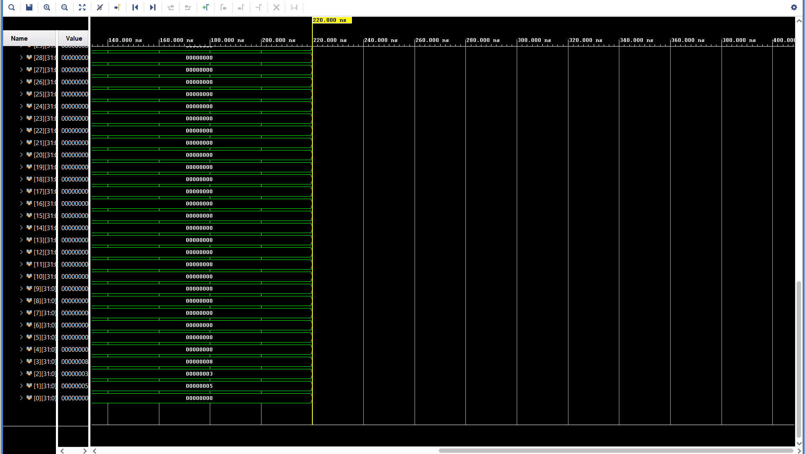

# Single-Cycle RISC-V Processor on FPGA

A fully functional 32-bit RISC-V processor core implemented in Verilog and synthesized on a Digilent Basys 3 FPGA board. This processor executes a subset of the RV32I instruction set and successfully performs arithmetic operations on physical hardware.


## 🚀 Features
* **Architecture:** 32-bit Single-Cycle RISC-V (Harvard Architecture).
* **ISA Subset:** RV32I (ADD, ADDI, BEQ, LW, SW, etc.).
* **Hardware Output:** Mapped the low program-counter bits to board LEDs for visual debugging.
* **Clock Management:** A clock-enable pulse advances the CPU about 6 times per second on the 100 MHz board clock. The cache services misses on the full board clock.

## 🛠️ Hardware & Tools
* **FPGA Board:** Digilent Basys 3 (Artix-7 XC7A35T).
* **Language:** Verilog HDL.
* **Synthesis Tool:** Xilinx Vivado 2023.
* **Simulation:** Vivado Simulator (XSim).

## 🧩 Modules Overview
The design follows a modular structure connecting the Data Path and Control Unit:
1.  **Program Counter (PC):** Handles instruction fetching and branching logic.
2.  **Instruction Memory:** Read-only memory initializing the machine code.
3.  **Register File:** 32x32-bit registers (x0 hardwired to 0).
4.  **ALU & Decoder:** Performs arithmetic/logical operations and generates Zero flags.
5.  **Data Memory:** RAM for Load/Store operations.
6.  **Control Unit:** Decodes opcodes to drive MUXs and write enables.
7.  **Clock Divider:** Reduces 100MHz input to 1Hz for real-time visualization.

## 📸 Simulation Results
Verified the data path using Vivado simulation waveforms before synthesis.


* Waveform showing the register file updating: x1=5, x2=3, x3=8.*

## 💻 How to Run
1.  Clone this repository.
2.  Open **Vivado** and create a new project targeting the **Basys 3**.
3.  Add all design `.v` files from `project_1.srcs/sources_1/new/` and set `RISCV_Top` as the design top.
4.  Add `project_1.srcs/constrs_1/new/Basys3_Master.xdc`.
5.  Add the testbenches in `project_1.srcs/sim_1/new/`. Run `tb_L1Cache` and `RISCV_TB` separately as simulation tops. Each prints `PASS` or stops with `$fatal`.
6.  Run **Synthesis**, **Implementation**, and **Generate Bitstream**. Program the device via USB.

## 📝 Test Program
The processor is currently hardcoded with this assembly sequence to demonstrate functionality:

```assembly
addi x1, x0, 0    ; Clear counter
addi x2, x0, 1    ; Set increment
add  x1, x1, x2   ; Increment counter
jal  x0, -4       ; Loop back to the add
```

The LEDs currently show the low 16 bits of the program counter (`DataAddr`). The instruction cache is direct-mapped with 256 one-word lines. For a future synchronous or external memory, assert `mem_ready` only when `mem_instr` is valid for the registered `mem_addr`.
